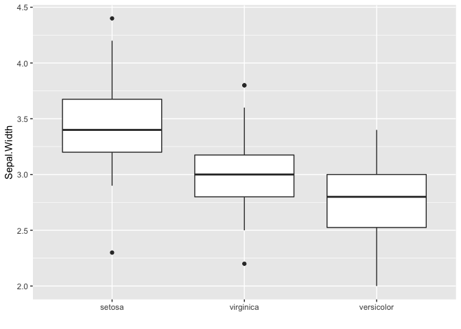

<!-- README.md is generated from README.Rmd. Please edit that file -->
**NOTE: This package was originally developed by [Jenny Bryan](https://github.com/jennybc). Most of the contents of this package were written by her, including the majority of this README, most of the vignette and two of the three foofactors functions. I developed the `reorder_desc` function and contents related to this function were written by me.**

**OTHER NOTE: This is a toy package created for expository purposes. It is not meant to actually be useful. If you want a package for factor handling, please see [forcats](https://cran.r-project.org/package=forcats).**

### foofactors

Factors are a very useful type of variable in R, but they can also drive you nuts. This package provides some helper functions for the care and feeding of factors as well as their levels.

### Installation

``` r
devtools::install_github("STAT545-UBC-students/hw07-fjbasedow/foofactors_master")
```

### Vignette

The vignette of this package can be found [here](http://127.0.0.1:27071/session/Rvig.5f4d43c63d0c.html).

### Quick demo

Binding two factors via `fbind()`:

``` r
library(foofactors)
a <- factor(c("character", "hits", "your", "eyeballs"))
b <- factor(c("but", "integer", "where it", "counts"))
```

Simply catenating two factors leads to a result that most don't expect.

``` r
c(a, b)
#> [1] 1 3 4 2 1 3 4 2
```

The `fbind()` function glues two factors together and returns factor.

``` r
fbind(a, b)
#> [1] character hits      your      eyeballs  but       integer   where it 
#> [8] counts   
#> Levels: but character counts eyeballs hits integer where it your
```

Often we want a table of frequencies for the levels of a factor. The base `table()` function returns an object of class `table`, which can be inconvenient for downstream work. Processing with `as.data.frame()` can be helpful but it's a bit clunky.

``` r
set.seed(1234)
x <- factor(sample(letters[1:5], size = 100, replace = TRUE))
table(x)
#> x
#>  a  b  c  d  e 
#> 25 26 17 17 15
as.data.frame(table(x))
#>   x Freq
#> 1 a   25
#> 2 b   26
#> 3 c   17
#> 4 d   17
#> 5 e   15
```

The `freq_out()` function returns a frequency table as a well-named `tbl_df`:

``` r
freq_out(x)
#> # A tibble: 5 x 2
#>   x         n
#>   <fct> <int>
#> 1 a        25
#> 2 b        26
#> 3 c        17
#> 4 d        17
#> 5 e        15
```

By default, factor levels are ordered by alphabet. However, sometimes we need to reorder the levels of factors according to the values in another variable, for example when we want to plot our data in ascending or descending order. The `reorder_desc` function from `foofactors` is a new descending version of `reorder` function from `stats`. It changes the order of the levels of a factor based on the values of a second variable in descending order:

``` r
Species_reordered_desc <- reorder_desc(iris$Species, iris$Sepal.Width, median)

library(ggplot2)
#> Warning: package 'ggplot2' was built under R version 3.4.4
ggplot(iris, aes(Species_reordered_desc, Sepal.Width)) + 
  geom_boxplot() +
  labs(x = "")
```


